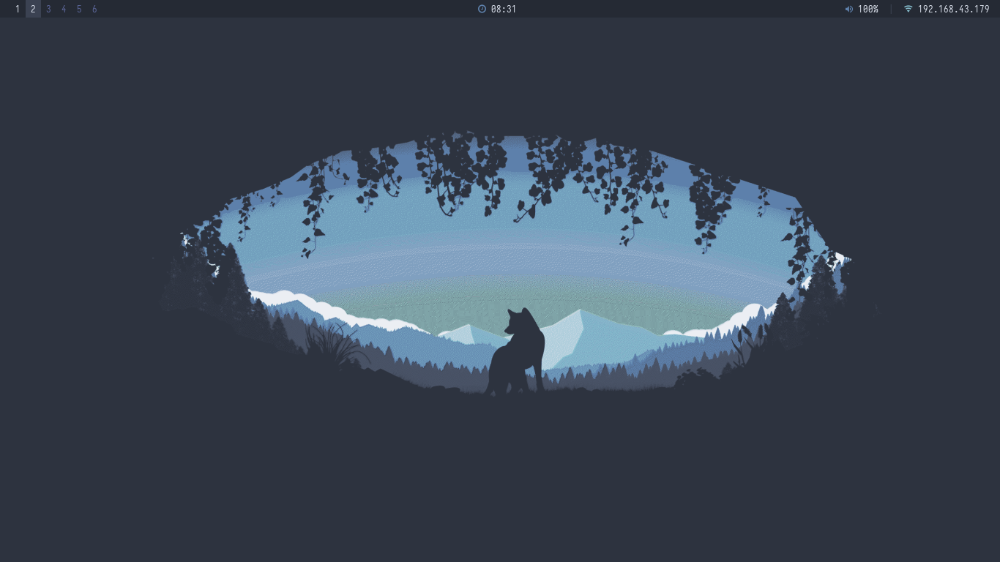
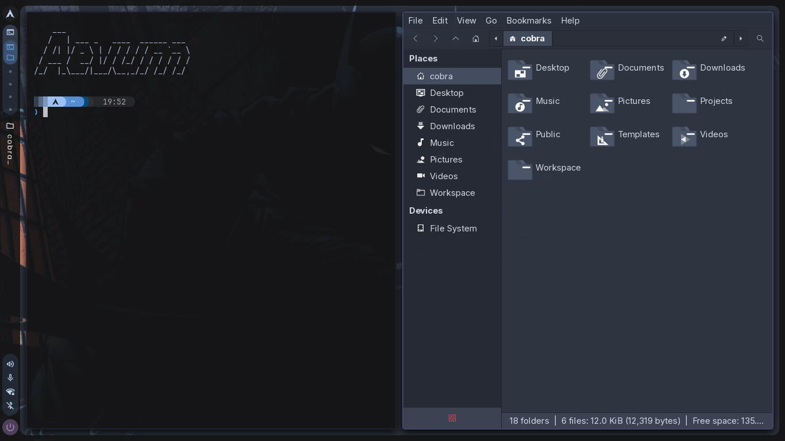
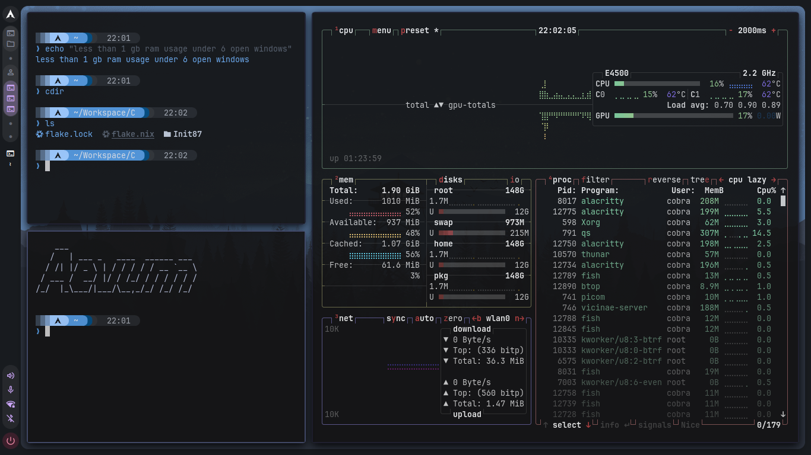
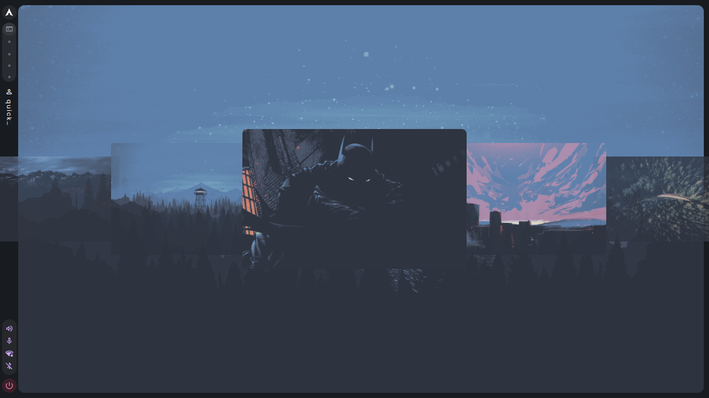

# Nordwolf Shell

> [!NOTE]
> This is the caelestia version of nordwolf shell. Do not expect it to work exactly as in caelestia, but I try to make it as similar as possible. Currently, all of the builds in `nordwolf-shell` are in development phase and **early volunteers** are welcomed. You can try this, and tell me if there are any bugs in this so that the quality of build in future versions will be less buggy. 

Give it a try. The x11 version of caelestia shell. 

## Previews (old)

 







Have you ever wondered how quickshell works in wayland? But its documentation says — it is not exclusive for wayland alone. Its basic non-wayland features are compatible with x11 as well, but we need to do other logic lifting which is not in x11 that is in wayland via scripts.

## Why Nordwolf Shell?

Being born into a desktop with low spec hardware — having all of the constraints that a student should not have (i.e, any programmer) — *2 GB DDR2 RAM*, *150 GB SATA HDD*, *BIOS input output system - Phoenix BIOS*, having *OpenGL version <=2.1* and *Intel Duo Core* and *no notable GPU* — my x11 managed to run the current state quickshell system.

This is specifically designed with constraints in mind — for low end systems, legacy systems, and x11 more importantly.

**Nordwolf Shell** is only for *tiling window managers* — whatever it is:

- **BSPWM** → the current choice of config.
- **i3WM** → future project after finishing BSPWM's shell integrations.
- **DWM** → ......
- ...... others too — planning to do it for most of the x11 WMs.

> [!NOTE]
> I was inspired to build **Nordwolf** mainly because I needed to use **[caelestia shell](https://github.com/caelestia-dots/shell)** — but as I am on *X11* and not *Wayland* (constraints: OpenGL), I was in need of building a caelestia-style shell specifically for x11 usage. It is rare — you would not have seen a quickshell config for x11.


## Is Quickshell Usable in X11?

**Absolutely yes.** At least, that is what the official documentation says. You can read about it [here](https://quickshell.org/about/). As quickshell is essentially a **wrapper** for [QML](https://doc.qt.io/qt-6/qml-tutorial.html):

- It works **as smooth as** any other Qt based application.
- Extremely themeable.
- Ah come on, I am not advertising anymore.

### But!!!

**What about animations?**

I am not going to assure you that animations will be very fluid like water on your desktop — but animations work, they exist, they are tunable. It would be more comfortable if you have:

- **Some GPU that is not old**
- **OpenGL 3+ version**
- **A good processor that is not `Intel Duo Core`**
- **2GB+ RAM that is not `DDR2`**

Unfortunately - I have a ddr2, intel duo core, a version that was in existence even before `i3`. 

> [!NOTE]
> All the above are a baseline — and I am on a baseline system. Animations are not as fluid as in caelestia shell, but they are smooth enough to be visually processed.

# Installation Process 1 : Non Nix Symlinks. 

This installation process will suit you if you do not have **nix** installed on top of **Arch based distro**, or if you are not from a **nixos** system. Follow the process step by step. I will assume that you are in a fresh system after a clean arch install. 

> [!IMPORTANT]
> This shell is based on pre-installed themes, icons and fonts that come along with the **Archcraft** distribution — nothing but Arch with pre-installed themes. You will be prompted to add the Archcraft repo to your `/etc/pacman.conf`. If you prefer to use your own themes — **you are very well welcomed to skip that step.**

### Prerequisites

- An Arch-based Linux distribution ( I have also provided a basic overview for installation of arch via archinstall script - as I did. )
- X11 display server
- A supported tiling window manager (BSPWM recommended)
- `yay` or another AUR helper installed

**1. Installing arch/arch based distro**

Most of the arch based distros come in with a handy calamere installer (or any other alternative installer). If you are installing a bare metal vanilla arch on the system using archinstall - make sure to select the following packages preinstalled when it asks for additional packages option.

- xorg  - all of the xorg display server utilities.
- bspwm - the binary space partitioning window manager
- git - for cloning and building AUR helper (yay:recommended) 
- curl 
- wget 
- base-devel - for building binaries

**If not,** you would have to manually use `sudo pacman -S ....` to install these packages

**2. Install the AUR helper**

As the installation script uses **yay**, I would recommend the use of yay. If you want to go with any other AUR helper of your choice, then you would have to use `sed ...` command to replace all `yay` with `paru` or something else. 

Then git clone and install yay from official arch repos via the following : 

```bash 
git clone https://aur.archlinux.org/yay.git 
cd yay 
makepkg -si
```

Once the build completes, you are ready to install nordwolf. 

### Steps

**1. Clone the repository**

```bash
git clone https://github.com/rudv-ar/nordwolf ~/.config/nordwolf
```

**2. Run the installer**

```bash
bash ~/.config/nordwolf/install.sh
```

This will:
- Install `fish` and set it as your default shell
- Link your fish config so `nordwolf` is immediately available
- Set up the Archcraft repo and keyring *(optional — skip if using your own themes)*
- Install all dependencies via `pacman` and `yay`
- Symlink all configs into `~/.config/`
- Symlink all local bins and share entries into `~/.local/`

**3. Open a new fish shell**

```bash
fish
```

`nordwolf` is now available. You can manage everything from here:

```
nordwolf deps install all        # install dependencies
nordwolf link-config add-all     # symlink configs
nordwolf link-local add-all      # symlink local bin/share
nordwolf deps verify all         # verify all deps
```

>[!WARNING]
> The syntax for `nordwolf` is `nordwolf <subcommand> <option> <flag>`. For getting help for each subcommand, you can use `nordwolf <subcommand> help`. Use the `-f` flag only if everything else fails during linking of configs via `link-config` and local files `link-local` subcommands.

**4. Restart your session** and launch BSPWM.

## CLI — `nordwolf`

| Command | Description |
|---|---|
| `nordwolf` | cd into `~/.config/nordwolf` |
| `nordwolf deps <args>` | dependency manager |
| `nordwolf link-config <args>` | config symlink manager |
| `nordwolf link-local <args>` | local bin/share symlink manager |
| `nordwolf srcrec <args>` | screen recorder |
| `nordwolf help` | show usage |


>[!WARNING]
> The installation process via the `nix` system is not yet complete. I recommend using non nix system for installation. Though I currently use `nix` and `home-manager` on top of arch as my **sweet-spot**, I have not included the packages from `nordwolf/cli/installer/deps.sh` into `home.nix` at home.pkgs. If you really wanna give the nix method a try, **you would have to add all those packages manually to your nix configuration.** Additionally, you would not be able to get the `archcraft` packages. As a result, you would need to install the themes, icon packs, cursors and fonts manually. 


## FAQS

### Why is my screen black on login?


1) *Missing Wallpaper* - If you are able to see the `nordwolf` shell initialised after login (i.e, the bars are visible) but the screen is black, you need to set wallpaper. 
- Every wallpaper is in ~/Workspace/Wallpapers by default. 
- If that directory does not exist, create it by `mkdir -p ~/Workspace/Wallpapers` and add wallpapers there. 
- Then open terminal by pressing `super + shift + enter`. 
- Run the following commands to get a wallpaper. 

```bash 
# create the workspace directory 
mkdir -p ~/Workspace/Wallpapers 

# if you want some other location for the wallpaper : you would have to edit the following files 
# I use nvim, you may use nano or whatever.
nvim ~/.config/nordwolf/config/bspwm/bspwm.d/sources/wallpaper.sh
nvim ~/.config/nordwolf/config/bspwm/apps/wallpicker/config.json

# add some wallpapers to that location. (add exactly 4 wallpapers for now for better wallpaper picker visuals.)

# generate the cache for wallpapers 
bash ~/.config/bspwm/apps/wallpicker/generate-cache.sh ~/.config/bspwm/apps/wallpicker/config.json

# now press super + w to open the wallpaper picker or just type the following in terminal.

wallpicker 

# then select the wallpaper using enter key and navigate using arrow keys.
```

>[!NOTE]
> Steps for manual path configurations will be added soon after a **settings GUI** has been built. If you need custom paths immediately, navigate to `~/.config/nordwolf/shell`. Each directory there is a component in this shell having a `settings` folder in there. Each `settings` folder has three or two(in some cases) files : `Theme.qml` (edit colors there), `Commands.qml` (decide what command executes and some paths), `Properties.qml` (sizes, width, file paths, etc). Edit them freely. 

>[!IMPORTANT]
> Make sure to run the above command while setting the wallpaper. The generate-cache.sh script utilises parallel processing using parallel. In case you generate cache for 5 or 10 + newly added wallpapers, it may hang brutally. So advised to generate cache after every new wallpaper is added. If you add it as a bunch, add maximum of **5 to 10** wallpaper and then generate cache. 

2.) *Picom Not Running or Unsupported* - The shell punches a transparent hole. without picom running, you would get a opaque screen without a see through. Make sure that your system have picom supported and well configured. 

### Why are my widgets taking long time to load? 

In this configuration : `~/.config/nordwolf/config/bspwm/widgets/quickshell/launch.sh` has a default sleep enabled for 5 to 10 seconds so that the window actually opens before setting rules via `xdotool`. As a world known fact that I use a potato PC, It takes more time for my xserver to draw the widgets, I enabled sleep 10; You may reduce it to 1 or 2 secs or just remove it if your PC is far above from the baseline requirments. 

To make sure that the classes are set for the shell, do the following. 

```bash 
# edit the sleep in the file : 
nvim ~/.config/nordwolf/config/bspwm/widgets/quickshell/launch.sh 
# after tuning it as per your will, press ctrl + shift + r to reload the bspwm config. 

(after the shell windows have initialised)

# check if the class is set; you would be prompted to click some window after running this command. You should click your left bar (any part of shell) to get its class.
xprop WM_CLASS


# if the class is well set, then good to go. (that is, if it returns qs-shell); if not, you need to add sleep and increase it as per your system requirements. 
```


# Features 

These are the features as of now for `caelestia branch`. 

- A full desktop border shell - **with dynamic themeing wired.**
- Picom transparency and blurs can be enabled in `~/.config/bspwm/bspwm.d/picom/rules.conf` : under the class name `qs-shell`. 
- A launcher placeholder with icon (non functional : functions are not yet wired - but present for left as well as right click.)
- A fully functional workspace indicator which shows the nodes present in the workspace as icons. Empty but unfocused ws as dots and empty but focused desktop as pacman icon. Has pilled pagination for windows (grouping). Click to go to the workspace. 
- A xtitle viewer just below the workspace, shows the title of the focused node. But truncation enabled by default. 
- A bottom anchored status pill section : wifi, battery, mic, volume, ethernet and bluetooth indicators wired. But they are currently in indicator stage. No functions or popouts wired so far. Wifi uses iwctl (iwd backend) and not network manager backend - currently lacks support for ethernet. 
- My preview images do not show a battery indicator because I use a PC - automatically capable of infering PC vs laptop. 
- A power button which shutdowns on left and reboots on right clicks. 
- The notifications, actions pane features are absent in this branch. Though they are present in the main and dev branches(horizontal bar system). 
- A time pill. A minimal clock which shows the curren time, date or day if enabled. (only time is enabled by default). Time has both international + AM, PM format. 


## Nix Specific Features : 

That said, I love being in this sweet spot : Nix pkg manager + home manager on top of **Arch**, excluding systemwide *systemd services*. At current stage, the nix home manager takes care of linking the configs, git profiles and ssh, mpd service and xdg-user directories. Looking forward for more suggestions. **I use nix on top of arch btw** and *Am learning nix - so mind correct my mistakes.*

- Currently added : home-manager's gtk theme modulation : icons, cursors and theme pack. 


# Customising the shell : 

>[!IMPORTANT]
> **Making modifications to shell properties :** At this point of the config, there is not any `config` file you can edit to change the properties of the shell. But **there is a `Theme.qml`** file in `~/.config/nordwolf/shell/config` directory. You can edit those values to tune your shell. There are those `togglable boolean values : true / false`, which you can try to change to see how the shell reacts. 


Examples : 

- you can change if the workspace indicator shows the number or not. 
- if the workspace pill should be colored or not. 
- if the time pill should show day also. 
- light and dark mode of the shell. 
- etc stuffs, more on the way. 


## Credits

- [Quickshell](https://quickshell.org) — the shell framework that made this possible on X11
- [Caelestia Shell](https://github.com/caelestia-dots/shell) — the original inspiration
- [Archcraft](https://archcraft.io) — for the themes, icons, and fonts


## Star History

[](https://www.star-history.com/?repos=rudv-ar%2Fnordwolf-shell&type=timeline&logscale=&legend=bottom-right)
